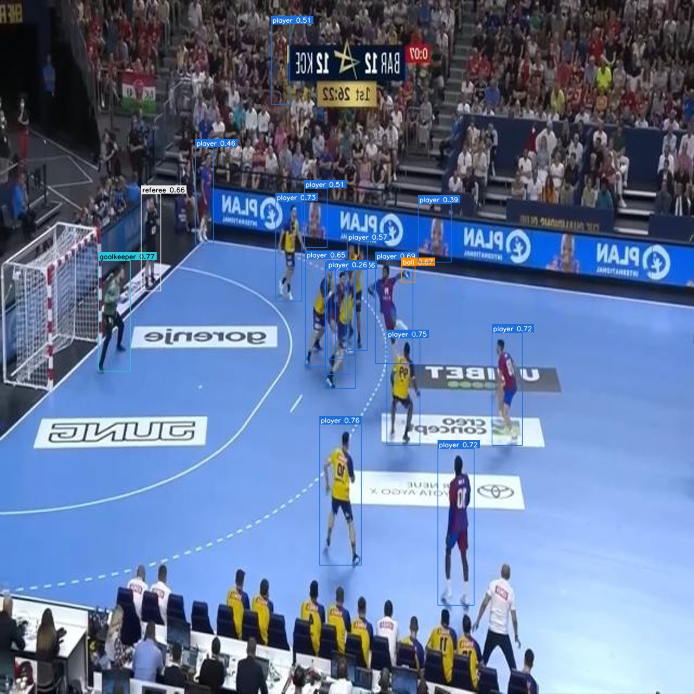
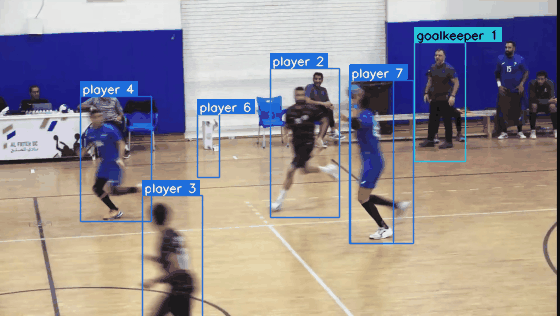
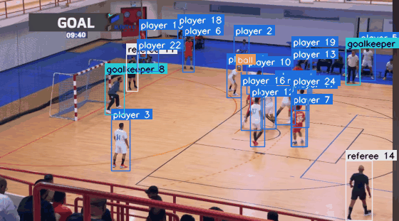
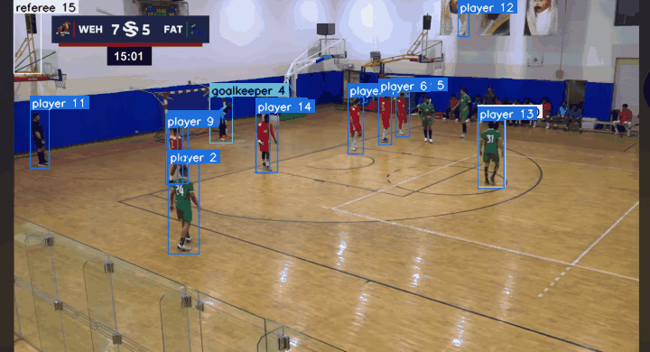

# Handball Video Analytics: Player, Goalkeeper, Referee and Ball Detection

Master's thesis project (Ain Shams University): *AI-Driven Sports Video Analysis for Performance and Strategy Optimization in Handball.*
Work in progress. The paper is not yet published, so this repository shows the approach and results, not the full pipeline.

## What it does
A YOLO11-based detector for broadcast handball video with four classes: **player, goalkeeper, referee, ball**.
Detections feed a tracker (ByteTrack) that assigns persistent IDs to people. This is the base for later analysis such as team assignment, speed and distance, and possession.

## Key finding: the ball failed because of the labels, not the model
The first model detected people well (mAP50 about 0.90) but almost never found the ball (F1 = 0.00).
Instead of changing the architecture, I audited the training data and found many frames where a visible ball had **no label**. The model was being taught that those balls are background.

What I did:
1. Audited the data and found near-duplicate frames leaking between the train and validation splits, so I rebuilt a **leak-free, group-based split**.
2. **Manually re-labelled the missing balls**, keeping the original files untouched.
3. Retrained with **identical settings and code**. The corrected labels are the only difference.

Ball F1 rose from 0.00 to 0.26 on a held-out test set, which I evaluated once, after fixing the final model.

| Baseline (original labels): ball missed | Final (corrected labels): ball found |
|---|---|
|  |  |

## Demo: detection and tracking on unseen footage
The final model with ByteTrack on a short clip that was not used for training or evaluation. Boxes show the class, and people also carry a track ID. This is a first tracking pass with default ByteTrack settings: the ball is found in some frames but not all, and IDs are not yet stable after occlusions. Improving this is part of the roadmap.

The footage is from one of my own matches, and I appear in the clip. I play handball professionally, so I know which errors matter on the court.

More clips from my match footage, run with the same settings. The left clip is handheld, with fast panning and motion blur, which is a hard case for a small ball. Detection of people is good, but ball detection and ID stability are not yet reliable. This is an ongoing project and I am continuing to improve it.

| Handheld camera, fast panning | Wide view with many players |
|---|---|
|  |  |



## Results (held-out test set, evaluated once)
Values are mAP50 / F1. YOLO11s, input size 1280.

| Class | Baseline | Final model |
|---|---|---|
| Player | 0.90 / 0.82 | 0.90 / 0.84 |
| Goalkeeper | 0.87 / 0.86 | **0.92 / 0.89** |
| Referee | **0.78 / 0.78** | 0.62 / 0.62 |
| Ball | 0.08 / 0.00 | **0.22 / 0.26** |

## Limitations (reported honestly)
- The ball is a tiny, fast, often blurred object, so ball detection is better but still the weakest class.
- On the test set the final model confuses some players with referees (referee score dropped from 0.78 to 0.62). I plan to address this with jersey-colour team assignment.
- Single training run per model. No confidence intervals yet.

## Roadmap
Tracking on full matches, team assignment by jersey colour, camera-motion compensation, court homography for speed and distance, possession analysis.

## Code in this repository
| File | Purpose |
|---|---|
| `tools/draw_predictions.py` | Draw clean predictions on a single image (used for the figures above) |
| `src/infer_video.py` | Run detection and ByteTrack on a video and export an annotated video plus CSV logs |
| `tools/make_demo_gif.py` | Run detection and tracking on a video segment and save a GIF (used for the demo above) |
| `src/common.py` | Small shared helpers |

Trained weights, datasets and the full training and evaluation pipeline are intentionally **not** included.

```bash
pip install -r requirements.txt
python tools/draw_predictions.py --weights <your_weights.pt> --source frame.jpg --output out.jpg
```

## Author
Hesham Hanafy · [LinkedIn](https://www.linkedin.com/in/heshamhanafy14/)

## License
All rights reserved. See [LICENSE](LICENSE). This repository is for viewing and evaluation only.
